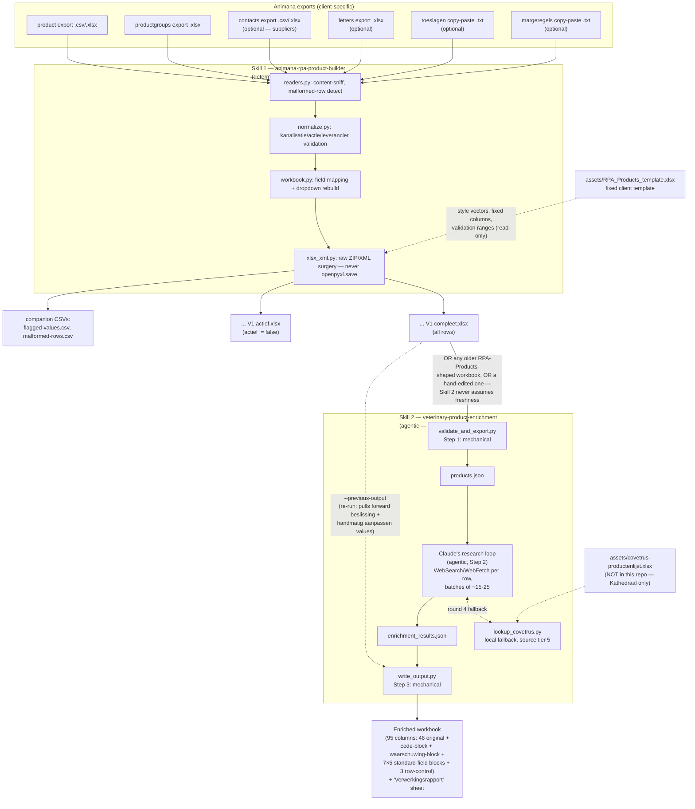

# CONTEXT.md — MEREL-VET-SKILLS

> LLM/agent map of this repository. Read this file in full before touching any code. It assumes zero prior context and is the single entry point for a fresh Claude instance (or any other agent) working in this tree. Human-facing narrative, incident history, and integration-test prose live in `README.md` — this file is the structural/reference map: where things are, what shape the data has, how data flows, and which invariants must never be broken.
>
> Repo purpose: two independent Claude Code **skills** for AetherLink client Merel Heijnen (veterinary business development, Animana ecosystem). Skill 1 is a deterministic ETL. Skill 2 is an agentic (Claude-driven) research/enrichment process. They chain together (Skill 1's output is valid Skill 2 input) but neither may assume the other ran.

---

## 0. Orientation — read this first

- **Skill 1** = `animana-rpa-product-builder/` — pure Python ETL, no AI judgment. Animana exports in → filled "RPA Products" Excel workbook out (client's fixed template, dropdowns rebuilt, XML-level surgery, never through openpyxl's writer).
- **Skill 2** = `veterinary-product-enrichment/` — agentic. Claude itself does WebSearch/WebFetch research per product row, guided by 4 mandatory reference docs, writes `huidig`/`voorstel`/`confidence`/`nieuw`/`beslissing` per field. The Python scripts around it only do mechanical Excel I/O and the deterministic "nieuw" decision logic.
- **`integration-test/`** = proof artifacts from a real (non-simulated) run chaining Skill 1 → Skill 2 on 2026-07-08. Read `integration-test/RESULTS.md` for the blow-by-blow, including two real bugs found and fixed during that run.
- Both skills are **independently installable/runnable** Claude Code skill folders (`SKILL.md` + `scripts/` + `references/` + `assets/` + `tests/`). Neither imports from the other.
- No `.git` directory exists yet in this staging tree at the time of writing; the public GitHub push is a separate, not-yet-completed step (see § Known gaps / open items — do not assume the repo is already on GitHub just because `README.md`'s status table says so).

---

## 1. Full folder map

### 1.1 Repository root

```
MEREL-VET-SKILLS-staging/                          (repo root)
├── README.md                                       Human-facing story: why this exists, architecture diagram,
│                                                    full field mappings (prose copy of the reference docs),
│                                                    the Covetrus off-by-one bug writeup, integration-test summary,
│                                                    known-incidents/transparency section, status table, credits.
│                                                    References merel-vet-skills-artwork.png as a banner image —
│                                                    that image file is NOT present in this tree (harmless, cosmetic gap).
├── CONTEXT.md                                       ← this file.
├── animana-rpa-product-builder/                    Skill 1 (deterministic ETL) — see § 1.2
├── veterinary-product-enrichment/                  Skill 2 (agentic enrichment) — see § 1.3
└── integration-test/                                Proof artifacts of a real cross-skill run — see § 1.4
```

### 1.2 Skill 1 — `animana-rpa-product-builder/`

```
animana-rpa-product-builder/
├── SKILL.md                            Skill entry point (frontmatter `name`/`description` used by Claude Code's
│                                        skill discovery). When to use, how to run, output shape, dependencies,
│                                        3 open questions to confirm before a real-client run.
├── assets/
│   └── RPA_Products_template.xlsx      The client's fixed Excel template. THE structural source of truth this
│                                        whole skill is built around (46-col "RPA Products edit" sheet + "dropdowns"
│                                        sheet). Never edited/reformatted — only its XML parts are read/copied.
├── references/
│   ├── field_mapping.md                Full Animana→RPA column mapping, price-field rule, validation rules
│                                        (kanalisatie/actie/leverancier), malformed-row handling, dropdowns column
│                                        map. Prose mirror of `scripts/rpa_builder/mapping.py` (mapping.py wins on conflict).
│   └── template_layout.md              WHY this skill bypasses openpyxl for writing (x14/extLst dropdown format),
│                                        sheet1 structural facts (448 pre-styled rows, style-vector reuse, inline
│                                        strings, row-cap bump above 448 rows), sheet2 structural facts (fixed vs
│                                        account-bound vs cleared columns, autosize approximation). **Read before
│                                        touching `xlsx_xml.py`.**
├── scripts/
│   ├── build_rpa_products.py           CLI entry point / orchestrator. Arg parsing, `--input-dir` auto-classification,
│                                        collision-safe output naming (`(2)`, `(3)`, ...), wires readers→workbook→xlsx_xml,
│                                        writes the two output workbooks + stdout report + companion CSVs.
│   └── rpa_builder/                     Package (all business logic lives here, `build_rpa_products.py` only orchestrates)
│       ├── __init__.py                  Empty (package marker only).
│       ├── mapping.py                   SINGLE SOURCE OF TRUTH for the business-spec constants: `RPA_HEADERS` (46,
│                                        A:AT), `RPA_COL` (name→0-based index), `DIRECT_FIELD_MAP` (Animana col →
│                                        RPA col), `NUMERIC_TARGET_FIELDS`, `FORCE_TEXT_TARGET_FIELDS`,
│                                        `BOOLEAN_PASSTHROUGH_TARGET_FIELDS`, `KANALISATIE_CANONICAL`,
│                                        `ACTIEF_COLUMN_LETTER` ("AM"), `FIXED_DROPDOWN_COLUMNS`,
│                                        `ACCOUNT_BOUND_DROPDOWN_COLUMNS`, `CLEARED_DROPDOWN_COLUMNS`,
│                                        `ACCOUNT_DROPDOWN_CAPACITY`. Change the mapping ONLY here.
│       ├── normalize.py                 Value-level normalization + validation. `normalize_kanalisatie()` (case/
│                                        whitespace-insensitive match only, never synonym-guesses),
│                                        `validate_actie()` (exact case-sensitive), `validate_leverancier()` (exact,
│                                        against THIS run's rebuilt list). Never guesses — always
│                                        pass-through-unchanged + flag.
│       ├── readers.py                   Source-file readers. Content-based format/role sniffing (never filename/
│                                        extension based): `PRODUCT_EXPORT_SIGNATURE`, `CONTACTS_SIGNATURE` header
│                                        sets; `sniff_role()`; `read_product_export()` (malformed-row detection by
│                                        column count); `read_productgroups()`, `read_letters()`,
│                                        `read_contact_suppliers()` (leverancier='true' filter), `read_copy_paste_list()`
│                                        (tab-separated, first field per line), `classify_copy_paste_file()`
│                                        (toeslagen vs margeregels by avg field count), `_dedupe_nonempty()`.
│       ├── dateutil_.py                 `derive_datum()` — parses DATUM from product-export filename (2 regex
│                                        patterns), falls back to file mtime; always reports which method was used.
│                                        Named `dateutil_.py` (trailing underscore) to avoid shadowing the real
│                                        `dateutil` package.
│       ├── workbook.py                  Orchestrates ETL→XML: `map_product_rows()` (applies DIRECT_FIELD_MAP +
│                                        validation, produces `MappedRow`/`InvalidValueFlag`), `is_active()` (actief
│                                        filter), `build_sheet1_xml()`, `build_sheet2_xml()` (dropdown rebuild +
│                                        capacity-warning detection). Owns the business mapping; xlsx_xml.py stays generic.
│       └── xlsx_xml.py                  Low-level, template-structure-aware XML surgery (the reason openpyxl is
│                                        never used to write). `TemplateXml` class (loads sheet1/sheet2 XML +
│                                        shared-strings once, exposes style vectors + fixed-column cell lookup +
│                                        `build_zip()` that copies every zip member verbatim except the two
│                                        rewritten worksheet parts). `inline_str_cell()`, `numeric_cell()`,
│                                        `empty_cell()`, `replace_sheet_data()`, `bump_validation_row_cap()` (only
│                                        touches `<xm:sqref>` "449" tokens, only above 448 rows), 
│                                        `replace_sheet1_structural_bits()` (cols/dimension/autoFilter),
│                                        `autosize_dropdowns_cols()`, `autosize_width()`, `col_letter()`/`col_index()`.
├── tests/
│   ├── conftest.py                      Shared fixtures: `run_cli()` (invokes the real CLI as a subprocess — several
│                                        assertions are only meaningful end-to-end through `main()`), `cli` fixture,
│                                        `run_full_dev_fixtures()`, `load_sheet1_rows()`, `read_zip_part()`,
│                                        `minimal_product_header`, `write_minimal_productgroups()`.
│   ├── fixtures/
│   │   ├── dev_fixtures/                Anonymized/synthetic dev fixtures (NOT real client data — see §5 invariant):
│   │   │   ├── export_product_dev.csv          301 source rows (299 valid + 2 malformed).
│   │   │   ├── export_client_dev.csv           Contacts/suppliers export (synthetic, uncorrelated to product export
│   │   │                                       supplier strings on purpose — explains the 282 flagged leverancier values).
│   │   │   ├── export.xlsx                     Letters export.
│   │   │   ├── productgroups.xlsx              Product groups export.
│   │   │   ├── Voorbeeld copy-paste toeslagen.txt      Tab-separated toeslagen copy-paste sample.
│   │   │   └── Voorbeeld copy-paste margeregels.txt    Tab-separated margeregels copy-paste sample.
│   │   └── make_scaling_fixture.py     Generates the synthetic 550-row scaling fixture (fixed constant, `n_rows=550` —
│   │                                    NOT 2× the 299-row dev-fixture, just a chosen value comfortably above the
│   │                                    template's 448-row cap) used to exercise the >448-row validation-cap-bump path.
│   ├── test_barcode_text_preservation.py       Barcode/code always written as text, leading zeros survive.
│   ├── test_fixed_dropdowns_byte_identical.py  The 7 fixed dropdown columns (G/I/K/O/Q/AA/AC) are byte-identical
│   │                                            to the template — this is the automated proof of INVARIANT #2.
│   ├── test_full_run_dev_fixtures.py            End-to-end run against the full dev-fixture set; row-count/
│   │                                            malformed-row/dropdown-count assertions.
│   ├── test_kanalisatie_normalization.py        Case/whitespace-insensitive canonical match, no synonym guessing.
│   ├── test_malformed_rows.py                   Wrong-column-count rows skipped + reported, never partially saved.
│   ├── test_numeric_fallback_flag_not_duplicated.py   Regression test for the fixed "flags list reused across two
│   │                                            build_sheet1_xml calls" bug (see README "Bekende incidenten").
│   ├── test_output_collision.py                 Never overwrites a prior run's output; numeric ` (2)` suffixing.
│   └── test_scaling.py                          Exercises the 550-row synthetic fixture / validation-cap-bump path.
└── .pytest_cache/                       (pytest artifact, not source — ignorable)
```

### 1.3 Skill 2 — `veterinary-product-enrichment/`

```
veterinary-product-enrichment/
├── SKILL.md                            Skill entry point. States the mandatory pre-research reading order
│                                        (source-hierarchy.md + confidence-and-status.md BEFORE the first WebSearch),
│                                        the 3-step workflow, the exact `enrichment_results.json` schema with a
│                                        worked example, the 6 nieuw-column decision rules, the ≥90% coverage goal
│                                        (a quality target, never a cutoff), and this skill's own file-structure map.
├── assets/
│   └── README-covetrus-asset.md        Placeholder note: the real `covetrus-productenlijst.xlsx` (sheet `PRIJS`,
│                                        ~17,551 rows) is NOT in this repo — it lives only on the Kathedraal at
│                                        `/home/merel/.claude/skills/veterinary-product-enrichment/assets/`.
│                                        `lookup_covetrus.py` degrades to `{"available": false}` when it's absent.
├── references/
│   ├── source-hierarchy.md             Bron-volgorde 1–7 (strict priority order) + the KNMvD/WVAB antibiotics-tier
│                                        rule. THE tie-breaker for any source conflict. Mandatory pre-read #1.
│   ├── confidence-and-status.md        The two independent scales: 5-value per-field confidence
│                                        (Hoog/Gemiddeld/Laag/Niet gevonden/Niet van toepassing) and the 8-value
│                                        row-level `resultaatstatus`. Mandatory pre-read #2. Never invent a 6th/9th value.
│   ├── field-rules.md                  Per-field rules (code+zoektermen, blad productinformatie, registratie,
│                                        waarschuwing+bronpassage, humaan, farmaceutische vorm incl. translation
│                                        table, werkzame stof(fen)+concentratie, kanalisatie) + product-type
│                                        recognition (11 types + onbekend) as the mandatory first per-row step.
│   ├── search-strategy.md              The 5 mandatory search rounds (exact ID → normalized name → official
│                                        databanks → manufacturer/supplier incl. lookup_covetrus.py → probable
│                                        match) + when "niet gevonden" is allowed + batching (~15-25 rows/batch,
│                                        parallel subagents above ~150 rows).
│   ├── output-schema.md                Readable mirror of `scripts/schema.py` — full 95-column layout, why a
│                                        per-field confidence column exists (auditability), why there's no separate
│                                        `producttype` column (scope discipline), the "Verwerkingsrapport" sheet.
│   ├── covetrus-mapping.md             The (now verified) 0-indexed column map for the bundled Covetrus asset —
│                                        see § 3.4 below. Contains the off-by-one bug writeup and the verification
│                                        commands run against the real 17,551-row asset.
│   └── test-plan.md                    Synthetic testworkbook plan (Metacam/Rimadyl/Clavubactin/Apoquel/Previcox/
│                                        Cerenia/Amoxibactin — deliberately covers every decision-logic edge case),
│                                        Skill-1-independence verification steps, missing-column validation path,
│                                        Covetrus-without-asset path, and the explicit note that real-clinic-data
│                                        validation happens ONLY on the Kathedraal, never in this repo/scratchpad.
├── scripts/
│   ├── schema.py                       SINGLE SOURCE OF TRUTH for both the RPA Products input shape and the
│                                        enrichment output shape. `RPA_COLUMNS` (46, mirrors Skill 1's `RPA_HEADERS`
│                                        verbatim), `REQUIRED_COLUMNS` (14 columns this skill actually needs),
│                                        `STANDARD_FIELDS` (7), `WAARSCHUWING_FIELD`, `CONFIDENCE_VALUES` (5),
│                                        `RESULTAATSTATUS_VALUES` (8), `BESLISSING_VALUES` (4, incl. ""),
│                                        `field_columns()`, `waarschuwing_columns()`, `CODE_OUTPUT_COLUMNS` (5),
│                                        `ROW_CONTROL_COLUMNS` (3), `enrichment_output_columns()`,
│                                        `full_output_columns()` (=95), `TEXT_FORMAT_COLUMNS` (barcode-family).
│   ├── decision_logic.py               Pure, deterministic "nieuw"-column rules (`compute_nieuw()`,
│                                        `compose_code_plus_zoektermen()`, `compute_code_nieuw()`). Independently
│                                        unit-testable, no I/O. `_norm()` does `html.unescape()` + strip one
│                                        trailing period for the rule-3 EQUALITY CHECK ONLY (post-integration-test
│                                        fix — never changes what's actually written to `nieuw`/`huidig`).
│   ├── validate_and_export.py          Step 1 (mechanical). `find_product_sheet()` (header-based, robust to a
│                                        renamed sheet), validates against `schema.REQUIRED_COLUMNS`, exits 2 with
│                                        an EXACT missing-column list on failure (never guesses a substitute),
│                                        exports `products.json` (row_index + 14 required fields per row).
│   ├── lookup_covetrus.py              Local (non-agentic) fallback lookup against the bundled Covetrus asset —
│                                        source-hierarchy tier 5. `COLUMNS` dict (0-indexed positions, verified —
│                                        see § 3.4). `lookup()` (barcode/artikelnummer exact match = score 100, name
│                                        = rapidfuzz token_sort_ratio if available else substring fallback = score
│                                        80), `verify_mapping()` (prints sample rows for a fresh-asset sanity
│                                        check), degrades to `{"available": false}` if the asset file is absent —
│                                        never raises. NOTE: the module's own top-of-file docstring is STALE — it
│                                        still says "inferred from only 3 sample rows... MUST be verified"; the
│                                        `COLUMNS` dict itself already reflects the corrected, verified mapping
│                                        (matches `covetrus-mapping.md` exactly). Don't be confused by the stale comment.
│   └── write_output.py                 Step 3 (mechanical). Builds output as a BRAND-NEW openpyxl Workbook
│                                        (never round-trips the original — see design note in the file's docstring,
│                                        same root cause as Skill 1's XML-surgery decision). `_read_original_rows()`,
│                                        `_load_previous_decisions()` (re-run support, keyed by `code (huidig)`,
│                                        pulls forward `beslissing` + preserves `handmatig aanpassen` nieuw-values
│                                        verbatim), `build_output()` (applies decision_logic per field, writes the
│                                        "Verrijking" sheet + the "Verwerkingsrapport" sheet, sets `number_format='@'`
│                                        on all TEXT_FORMAT_COLUMNS, re-opens the file it just wrote as a smoke test).
├── tests/
│   ├── conftest.py                      `_sample_row()`, `write_rpa_workbook()` (builds a minimal RPA-shaped
│                                        workbook, lets a test drop/rename columns), `sample_row`/`rpa_workbook_factory`
│                                        fixtures.
│   ├── test_decision_logic.py           Unit tests for all 6 compute_nieuw rules + the beslissing overrides +
│                                        the trailing-period/HTML-entity `_norm()` regression tests + the guard
│                                        test proving a genuine paraphrase still gets flagged.
│   ├── test_lookup_covetrus.py          Asset-absent graceful degradation, barcode/artikelnummer exact match,
│                                        name fuzzy match, `verify_mapping()` output shape.
│   ├── test_validate_and_export.py      Required-column detection (exit 2 + exact missing list), successful
│                                        export shape, sheet-name robustness.
│   └── test_write_output.py             Full output-shape assertions (95 columns), re-run/`--previous-output`
│                                        merge behavior, `handmatig aanpassen` preservation, barcode text-format
│                                        preservation, stats/coverage reporting.
└── .pytest_cache/                       (pytest artifact, not source — ignorable)
```

### 1.4 `integration-test/` — proof artifacts (not skill source, not fixtures)

```
integration-test/
├── RESULTS.md                                  THE primary record of the real (non-simulated) cross-skill run,
│                                                2026-07-08. Read this, not a summary of it, before trusting any
│                                                integration claim. Documents 2 real bugs found+fixed live during
│                                                the run (numeric-fallback-flag duplication in Skill 1 — actually
│                                                fixed earlier, see README; the `decision_logic._norm()` exact-string
│                                                vs semantic-equality issue — fixed in this run). NOTE: this file
│                                                self-contradicts on whether the pytest suites were run as part of
│                                                THIS task — its own body reports "53/53 passed (was 50)" / "20/20
│                                                passed" as if freshly re-run here, but its own "Gaps" section says
│                                                "pytest suites for either skill were not part of this task and were
│                                                not run here". Don't silently resolve this by editing RESULTS.md;
│                                                see README.md's "Bronkanttekening" under the integration-test section
│                                                for how it's disclosed. (Independently re-running both suites today
│                                                does confirm 20/20 and 53/53 currently pass — that part checks out.)
├── skill1-output/                              Real Skill-1 output used as Skill-2 input (the independence proof):
│   ├── RPA Integratietest Kliniek 2026-07-08 V1 compleet.xlsx      299 rows.
│   ├── RPA Integratietest Kliniek 2026-07-08 V1 actief.xlsx        224 rows.
│   ├── RPA Integratietest Kliniek 2026-07-08 flagged-values.csv
│   └── RPA Integratietest Kliniek 2026-07-08 malformed-rows.csv
├── products.json                               Skill-2 Step-1 output, read directly from skill1-output's compleet
│                                                file — zero manual adjustment (the actual independence evidence).
├── compleet-missing-registratie.xlsx           Negative-path fixture: real Step-1 output with the `registratie`
│                                                header cell (row 1, column AB) renamed — proves the exit-code-2 path.
├── enrichment_results.json                     8 real, agentically-researched rows (Panacur KH, Cardisure, Apoquel,
│                                                Nobivac KC, Isathal, Nobivac Lepto 4/DHP, Amoxibactin, Furosoral) —
│                                                see RESULTS.md for the live WebSearch/WebFetch sourcing per row.
├── products-rerun.json                         Re-run artifact from the rerun-verify exercises below.
├── RPA Integratietest Kliniek verrijkt.xlsx     write_output.py's FIRST run — 3 rows flagged for review (pre-fix).
├── RPA Integratietest Kliniek verrijkt POST-FIX.xlsx          Re-run after the `_norm()` fix — 2 rows flagged.
├── RPA Integratietest Kliniek verrijkt POST-FIX-VERIFY.xlsx   Follow-up verification pass.
├── verrijkt-rerun.xlsx                         Additional rerun artifact (--previous-output merge exercise).
├── rerun-verify/
│   ├── RPA Integratietest Kliniek Rerun 2026-07-08 V1 actief.xlsx
│   └── RPA Integratietest Kliniek Rerun 2026-07-08 V1 compleet.xlsx
└── rerun-verify2/
    ├── RPA RerunTwo 2026-07-08 flagged-values.csv
    ├── RPA RerunTwo 2026-07-08 malformed-rows.csv
    ├── RPA RerunTwo 2026-07-08 V1 actief.xlsx
    ├── RPA RerunTwo 2026-07-08 V1 compleet.xlsx
    └── rerun2.log
```

None of the files under `integration-test/` are real clinic data — they all derive from the anonymized dev fixtures under `animana-rpa-product-builder/tests/fixtures/dev_fixtures/`.

---

## 2. Dataflow diagram



Key point the diagram encodes: the arrow from Skill 1's output into Skill 2 is **not a hard dependency** — Skill 2's `validate_and_export.py` only requires the 14 `REQUIRED_COLUMNS` header names to be present; it works identically on a fresh Skill-1 output, an old run, or a hand-edited file (proven in `integration-test/RESULTS.md` Step 2 and Step 3, the negative-column-rename path).

---

## 3. Data-model trees

### 3.1 Skill 1 — RPA Products sheet 1 ("RPA Products edit"), 46 columns A:AT

Single source of truth: `animana-rpa-product-builder/scripts/rpa_builder/mapping.py` (`RPA_HEADERS`/`RPA_COL`) — mirrored verbatim in Skill 2's `scripts/schema.py` (`RPA_COLUMNS`), which is how the two skills stay in lockstep without importing each other.

| Letter | Column name (RPA) | Animana source column | Target type | Note |
|---|---|---|---|---|
| A | productgroep | productgroep | text | |
| B | naam | naam | text | |
| C | nieuwe naam | *(none)* | — | **intentionally always blank** |
| D | code | shortcode | text, **force-text** | |
| E | factuurtekst | factuurtekst | text | |
| F | kostprijs | kostprijs | **numeric** | real number; text fallback + flag if unparseable |
| G | basisprijs | *(none)* | — | **intentionally always blank** |
| H | btw | btw | text (literal category) | 'hoog'/'laag'/'geen' — never converted to % |
| I | marge product | *(none)* | — | **intentionally always blank** |
| J | verkoopprijs ex | verkoopprijs | **numeric** | Animana's `verkoopprijs` is EX btw |
| K | verkoopprijs incl | *(none)* | — | **NEVER computed/copied — Animana fills this after import** (see §5 invariant) |
| L | toeslag | *(none)* | — | **intentionally always blank** |
| M | korting | *(none)* | — | **intentionally always blank** |
| N | verkoopeenheid | verkoopeenheid | text | |
| O | verpakkingsfactor | verpakkingsfactor | **numeric** | |
| P | verpakkingseenheid | verpakkingseenheid | text | |
| Q | bestelfactor | bestelfactor | **numeric** | |
| R | besteleenheid | besteleenheid | text | |
| S | dosering | dosering | text | |
| T | vrije tekst | vrije tekst | text | |
| U | analysegroep 1 | *(none)* | — | **intentionally always blank** |
| V | analysegroep 2 | *(none)* | — | **intentionally always blank** |
| W | analysegroep 3 | *(none)* | — | **intentionally always blank** |
| X | gewicht | *(none)* | — | **intentionally always blank** |
| Y | etiket niet printen | *(none)* | — | **intentionally always blank** |
| Z | blad productinformatie | Blad productinformatie | text | |
| AA | verrichting | *(none)* | — | **intentionally always blank** |
| AB | registratie | registratie | text | |
| AC | waarschuwing | waarschuwing | text | |
| AD | memo | memo | text | |
| AE | opiaat | opiaat | literal 'true'/'false' | unchanged passthrough |
| AF | humaan | humandrug | literal 'true'/'false' | unchanged passthrough |
| AG | euthanasaat | euthanasie | literal 'true'/'false' | unchanged passthrough |
| AH | registratie minuten | registratie minuten | **numeric** | |
| AI | actie | actie | text, **validated** | exact match `euthanasia`/`castration` or empty; else pass-through+flag |
| AJ | brief | *(none)* | — | **intentionally always blank** |
| AK | toon product | *(none)* | — | **intentionally always blank** |
| AL | verberg | *(none)* | — | **intentionally always blank** |
| AM | actief | actief | literal 'true'/'false'/'' | drives the actief-file filter (`ACTIEF_COLUMN_LETTER`) |
| AN | farmaceutische vorm | farmaceutische vorm | text | |
| AO | werkzame stof(fen) en concentratie | werkzame stof(fen) en concentratie | text | |
| AP | leverancier | leverancier | text, **validated** | exact match against this run's rebuilt supplier list, or empty; else pass-through+flag |
| AQ | artikelnummer | artikelnummer | text | |
| AR | kanalisatie | kanalisatie | text, **normalized** | case/whitespace-insensitive match to `{udd,uda,ura,vrij}`, else pass-through unchanged+flag |
| AS | barcode | barcode | text, **force-text** | always text, never numeric — preserves leading zeros |
| AT | voorraad obv verpakking | stockonpackage | literal 'true'/'false' | unchanged passthrough |

15 columns are explicitly left blank (C, G, I, K, L, M, U, V, W, X, Y, AA, AJ, AK, AL — see table above) as a deliberate scope boundary, not an oversight — do not populate them even if a plausible Animana column exists.

### 3.2 Skill 1 — dropdowns sheet column map

19 "content" columns, separated by never-populated narrow spacer columns.

| Letter | Label | Class | Rebuild source | Capacity |
|---|---|---|---|---|
| A | productgroepen | **account-bound** | productgroups export, `naam` column | 248 rows |
| C | toeslagen | **account-bound** | toeslagen copy-paste `.txt`, first tab-field/line | 48 rows |
| E | margeregels | **account-bound** | margeregels copy-paste `.txt`, first tab-field/line | 48 rows |
| M | leveranciers | **account-bound** | contacts export, rows where `leverancier='true'`, `bedrijfsnaam` column, deduped | 48 rows |
| Y | brieven | **account-bound** | letters export, `naam` column (`context` col ignored) | 248 rows |
| G | eenheden | **fixed** | byte-identical to template, never touched | n/a |
| I | btw | **fixed** | byte-identical to template, never touched | n/a |
| K | optie | **fixed** | byte-identical to template, never touched | n/a |
| O | kanalisatie | **fixed** | byte-identical to template, never touched | n/a |
| Q | actie | **fixed** | byte-identical to template, never touched | n/a |
| AA | aanklikken | **fixed** | byte-identical to template, never touched | n/a |
| AC | herinnertype | **fixed** | byte-identical to template, never touched | n/a |
| S | analysegroep 1 | **cleared** | values wiped (row 2+), header label kept | n/a |
| U | analysegroep 2 | **cleared** | values wiped (row 2+), header label kept | n/a |
| W | analysegroep 3 | **cleared** | values wiped (row 2+), header label kept | n/a |
| AE | herinnergroep | **cleared** | values wiped (row 2+), header label kept | n/a |
| AG | notificatie | **cleared** | values wiped (row 2+), header label kept | n/a |
| AI | prijsgroep | **cleared** | values wiped (row 2+), header label kept | n/a |
| AK | magazijn | **cleared** | values wiped (row 2+), header label kept | n/a |

Account-bound lists are case-sensitive-deduped, first-seen order kept, empty values skipped. If a missing optional source export means one of these columns has nothing to rebuild from, the column is left completely empty (header label untouched) and the run report notes it under "Optional inputs missing" — never silently.

### 3.3 Skill 2 — huidig/voorstel/nieuw/beslissing schema per field (95 columns total)

Single source of truth: `veterinary-product-enrichment/scripts/schema.py`. Full column order:

**Block 0 — original (46 cols):** `RPA_COLUMNS` verbatim, unchanged, in original order (see § 3.1 table, column-name values only — this block carries no letter-position meaning of its own in the *output* workbook; it's just "first 46 columns, same order as Skill 1's sheet").

**Block 1 — code (5 cols)**, special shape (composition, not a plain value swap):
| Column | Meaning |
|---|---|
| `code (huidig)` | original `code` value, verbatim |
| `zoektermen (voorstel)` | Claude's ≤3 search terms, comma-joined for display |
| `code + zoektermen (voorstel)` | mechanically composed by `decision_logic.compose_code_plus_zoektermen()`: `huidig` + up to 3 terms, space-separated |
| `beslissing (code)` | `akkoord` \| `niet akkoord` \| `handmatig aanpassen` \| `""` |
| `code (nieuw)` | mechanically computed by `decision_logic.compute_code_nieuw()` — no automatic overwrite without a decision |

**Block 2 — waarschuwing (6 cols)**, the only standard-shaped field with an extra bronpassage column:
| Column | Meaning |
|---|---|
| `waarschuwing (huidig)` | original value |
| `waarschuwing (voorstel)` | Claude's proposed short warning (max 5 words) |
| `waarschuwing (confidence voorstel)` | one of the 5 confidence values |
| `waarschuwing bronpassage (voorstel)` | exact source-text fragment backing the proposal — kept separately for verification |
| `waarschuwing (nieuw)` | mechanically computed by `decision_logic.compute_nieuw()` |
| `beslissing (waarschuwing)` | akkoord / niet akkoord / handmatig aanpassen / "" |

**Blocks 3–9 — 7 standard fields × 5 cols each (35 cols total).** Fields, in order: `blad productinformatie`, `registratie`, `humaan`, `farmaceutische vorm`, `werkzame stof(fen) en concentratie`, `kanalisatie`, `barcode`. Per field:
| Column pattern | Meaning |
|---|---|
| `{veld} (huidig)` | original value, verbatim, never mutated |
| `{veld} (voorstel)` | Claude's researched proposal |
| `{veld} (confidence voorstel)` | Hoog / Gemiddeld / Laag / Niet gevonden / Niet van toepassing |
| `{veld} (nieuw)` | mechanically computed by `decision_logic.compute_nieuw()` per the 6 rules (§ 3.3.1) |
| `beslissing ({veld})` | akkoord / niet akkoord / handmatig aanpassen / "" |

**Block 10 — row-level control (3 cols, no more, no less — deliberately not extended with a `producttype` column):**
| Column | Meaning |
|---|---|
| `bron URL` | primary source URL for this row's research |
| `resultaatstatus` | one of 8 holistic values (§ confidence-and-status) |
| `toelichting controle` | free text: which search rounds were actually run, product-type reasoning, anything a reviewer needs |

Total: 46 + 5 + 6 + (7×5) + 3 = **95**.

Plus a second worksheet, **"Verwerkingsrapport"**: total product count, coverage %, rows needing manual review, and a count per `resultaatstatus` value.

#### 3.3.1 The 6 `compute_nieuw` rules (verbatim, `decision_logic.py`)

1. `huidig` filled + no reliable voorstel → `nieuw = huidig` (unchanged).
2. `huidig` empty + voorstel confidence = **Hoog** → `nieuw = voorstel` (auto-fill).
3. `huidig` and `voorstel` are equal (after `_norm()`: HTML-unescape + strip one trailing period, case/whitespace-insensitive — equality-check only, never changes what's written) → `nieuw` = that value.
4. `huidig` and `voorstel` **differ** → `nieuw` NOT auto-changed (stays `huidig`), row flagged for review.
5. Confidence Gemiddeld/Laag differs from `huidig` → never auto-adopted.
6. No result at all → `nieuw = huidig` (stays empty only if `huidig` was already empty).

`beslissing` overrides all of the above: `akkoord` → `nieuw = voorstel`; `niet akkoord` → `nieuw = huidig`; `handmatig aanpassen` → function returns `(None, False)` as a sentinel; the **caller** (`write_output.py`, via `_load_previous_decisions()`) must preserve whatever `nieuw` value already exists from a prior run and never touch it again.

### 3.4 Covetrus fallback asset — verified 0-indexed column map

Source: `veterinary-product-enrichment/references/covetrus-mapping.md`, implemented in `scripts/lookup_covetrus.py`'s `COLUMNS` dict. Verified 2026-07-08 against the full 17,551-row asset (bundled asset itself is **not** in this repo — see § 5 invariant).

| 0-indexed | Excel column | Field | Example value |
|---|---|---|---|
| 0 | A | Omschrijving | "Clavusan 500mg/125mg tablet" |
| 1 | B | Leverancier | "ALFASAN NL" |
| 4 | E | Prijs | "187.15" |
| 7 | H | Covetrus-eigen artikelnummer | "4009001" |
| 8 | I | Registratie-achtige code | "RVG06193" / "REGNL08608" |
| 10 | K | Barcode/GTIN (13-digit EAN) | "5701170461398" |
| 12 | M | Kanalisatie-achtige korte code | "UA" / "URA" / "UDD" |

Columns C, D, F, G, J, L hold other Covetrus-internal fields (a constant `1`, verkoopeenheid, a verpakkingsfactor, a stock-ish number in L) — not used by this skill. This table was previously **wrong** (an earlier version of `covetrus-mapping.md` labeled itself "0-indexed" but actually contained 1-indexed Excel column numbers) — see § "Where to find X" → "the Covetrus off-by-one bug" for the full incident writeup and why any future re-verification of a new Covetrus file must run `python scripts/lookup_covetrus.py --verify-mapping` again, never trust the label on a table alone.

Kanalisatie-like short codes from Covetrus (e.g. `"UA"`) are **not** blindly 1:1-mapped to the canonical `uda`/`ura`/`udd`/`vrij` set — `field-rules.md` requires checking the source documentation's own meaning before normalizing, since UA/UD conventions can differ by source.

---

## 4. "Where to find X" table

| I need to know / change... | Go to |
|---|---|
| The Animana→RPA field mapping (business spec) | `animana-rpa-product-builder/scripts/rpa_builder/mapping.py` (code, wins on conflict) or `references/field_mapping.md` (prose mirror) |
| Which 46 columns Skill 1 writes, in what order/letter | `mapping.py: RPA_HEADERS` / § 3.1 above |
| The dropdowns sheet's fixed/account-bound/cleared column split | `mapping.py` (3 dict constants) / `references/field_mapping.md` / § 3.2 above |
| Why Skill 1 never uses openpyxl to write | `references/template_layout.md` + docstring at top of `xlsx_xml.py` |
| How the >448-row scaling / validation-cap-bump works | `xlsx_xml.py: bump_validation_row_cap()` + `references/template_layout.md` + `tests/test_scaling.py` + `tests/fixtures/make_scaling_fixture.py` |
| How a source file's role (product export vs contacts vs...) gets auto-detected | `readers.py: sniff_role()`, `PRODUCT_EXPORT_SIGNATURE`, `CONTACTS_SIGNATURE` |
| How the output DATUM is derived | `dateutil_.py: derive_datum()` — 2 regex patterns, else file mtime, always reports which |
| kanalisatie/actie/leverancier validation rules | `normalize.py` + `references/field_mapping.md` "Validatieregels" |
| Skill 1's known open questions before a real-client run | `SKILL.md` "Known open questions" (3 items: DATUM convention, actie/leverancier case-sensitivity, cleared-columns header-row assumption) |
| Skill 2's mandatory pre-research reading order | `SKILL.md` "Verplichte leesvolgorde" → `source-hierarchy.md` then `confidence-and-status.md` |
| The strict source priority order (1–7) for research conflicts | `references/source-hierarchy.md` |
| The 5-value field-confidence scale and 8-value resultaatstatus scale | `references/confidence-and-status.md` |
| Per-field research rules + product-type recognition | `references/field-rules.md` |
| The 5 mandatory search rounds + batching guidance | `references/search-strategy.md` |
| The full 95-column output layout (single source of truth) | `veterinary-product-enrichment/scripts/schema.py` (code) or `references/output-schema.md` (prose mirror) |
| The `nieuw`-column decision rules (deterministic) | `scripts/decision_logic.py` + § 3.3.1 above |
| The Covetrus fallback column map + its off-by-one bug history | `references/covetrus-mapping.md` + § 3.4 above + `README.md` "Lessons learned" section |
| How re-runs preserve human decisions (`--previous-output`) | `write_output.py: _load_previous_decisions()` — keyed on `code (huidig)` |
| Whether Skill 2 assumes fresh Skill-1 input | It never does — see `SKILL.md` Stap 1, `references/test-plan.md` § 2, and the independence proof in `integration-test/RESULTS.md` Step 2–3 |
| Real end-to-end proof this actually works together | `integration-test/RESULTS.md` (not a summary — read the actual doc) |
| Known incidents / self-reported issues during the build | `README.md` § "Bekende incidenten / transparantie" |
| Whether real client data is anywhere in this repo | It is not — see § 5 invariant below and `README.md` incident (a) |
| Current production-readiness / test-pass status | `README.md` § "Status" table |

---

## 5. § INVARIANTS (do not break)

These are non-negotiable. If a change would violate one of these, stop and raise it explicitly rather than "fixing" it silently.

1. **Skill 2 never silently overwrites existing data.** Every enrichable field carries `huidig` (untouched original) alongside `voorstel`/`nieuw`. The `nieuw` column only auto-adopts a proposal when `huidig` is empty AND confidence is `Hoog` (rule 2), or when `huidig`/`voorstel` are equal (rule 3), or when a human has explicitly recorded `beslissing = akkoord`. Any other case leaves `nieuw = huidig` and flags the row for review. This is enforced in `decision_logic.compute_nieuw()` and is the single most important behavioral contract in this repo — do not "improve" it to auto-fill more eagerly, even under pressure to raise the coverage number.

2. **The 7 fixed dropdown columns (G, I, K, O, Q, AA, AC — eenheden/btw/optie/kanalisatie/actie/aanklikken/herinnertype) must stay byte-identical to the template.** They are copied cell-fragment-for-cell-fragment straight from the template's own XML (`TemplateXml.fixed_column_cell()`), never regenerated from parsed values. This is the strongest fidelity guarantee in Skill 1 and is asserted by `tests/test_fixed_dropdowns_byte_identical.py`. Never rebuild these from a source export, even if a plausible-looking source column exists.

3. **`verkoopprijs incl` (RPA column K) always stays empty.** Animana computes this itself after import; it is never calculated, derived, or copied from any Animana source column by this tooling — confirmed explicitly by Merel. Do not add a computation for this column under any circumstance, even if a client export appears to contain a compatible "incl btw" value.

4. **Kanalisatie output is only ever exactly one of `udd` / `uda` / `ura` / `vrij`, always lowercase.** Both skills enforce this independently: Skill 1's `normalize.py: normalize_kanalisatie()` only case/whitespace-normalizes an exact canonical match and passes through+flags anything else (no synonym guessing, e.g. `"free"` is never auto-mapped to `"vrij"`); Skill 2's `field-rules.md` explicitly forbids inventing a 5th category and requires leaving `nieuw` empty + flagging for review on anything unclear/contradictory, even when a plausible source mapping (e.g. Covetrus `"UA"`) exists but isn't confirmed.

5. **Barcode is always stored as text, never as a number.** Skill 1: `FORCE_TEXT_TARGET_FIELDS = {"barcode", "code"}`, written via `inline_str_cell()` regardless of how numeric the value looks (preserves leading zeros). Skill 2: `schema.TEXT_FORMAT_COLUMNS` covers `barcode`, `barcode (huidig)`, `barcode (voorstel)`, `barcode (nieuw)`; `write_output.py` forces `number_format = '@'` on all of them. Never let barcode round-trip through a numeric cell type in either skill.

6. **The two skills must remain fully independently runnable.** Skill 2's `validate_and_export.py` makes zero assumption that its input came from Skill 1 — it only requires the header row to contain `schema.REQUIRED_COLUMNS` (14 names), and reports an exact missing-column list + exits 2 if not, never guessing a substitute. Neither skill imports from the other's package. Do not introduce a hard dependency (e.g. Skill 2 importing `rpa_builder`, or Skill 1 assuming Skill 2 will run afterward) — the whole point is that Skill 2 must also work standalone on an old run or a hand-edited workbook.

7. **Real confidential clinic/Covetrus data never gets committed to this repo.** Only synthetic/anonymized fixtures belong here: `animana-rpa-product-builder/tests/fixtures/dev_fixtures/*` (anonymized dev exports, deliberately uncorrelated leverancier values), the synthetic testworkbook described in `references/test-plan.md` (Metacam/Rimadyl/Clavubactin/Apoquel/Previcox/Cerenia/Amoxibactin — all public, well-known products), and `integration-test/*` (derived only from the anonymized dev fixtures). The real Covetrus product list (17,551 rows, client-supplied) exists **only** on the Kathedraal, never in this tree — `assets/README-covetrus-asset.md` is a placeholder note, not the asset. Real-clinic-data validation happens only on the Kathedraal, outside this repo/scratchpad, by explicit prior agreement — see `README.md` incident (c). Never add a real client export, a real Covetrus file, or any file from `Desktop\Merel\` (Marco's confidential clinic-list folder, entirely outside this repo) to this tree or to git.

---

## 6. Known gaps / open items (be aware, don't silently "fix")

- **GitHub push status is unclear/contradictory.** `README.md`'s status table claims "GitHub-repo (deze repo) ✅ Aangemaakt en gepusht", but this staging tree has no `.git` directory, and the project's own task tracker (visible in-session) lists "Create public GitHub repo MEREL-VET-SKILLS and push everything" as still **pending**. Do not assume either state — check directly (`git remote -v`, `gh repo view Maca2024/MEREL-VET-SKILLS` or similar) before reporting push status as fact.
- **RALF quality gate never ran over the original build of either skill** (worktree-isolation infrastructure fault) — only a later, separate RALF pass over the test-/integration-work exists (scores 0 / 100 / 49 for skill1-tests / skill2-tests / integration-test respectively — see `README.md` incident (b) for what each score does and doesn't mean). **No persisted RALF artifact (log/JSON/score file) for these three numbers exists anywhere in this repo or the wider scratchpad** — only the orchestration script that would have computed them at runtime via sub-agent calls. Treat the 0/100/49 table as a reported outcome of that session, not a file-verifiable one; do not cite it as stronger evidence than that.
- **Skill 2's agentic research loop is proven on only 8 real rows**, not at the ≥90%-coverage scale the skill targets — that requires the full batching workflow in `search-strategy.md` run against a complete real file, not yet done.
- **`lookup_covetrus.py`'s own top-of-file docstring is stale** (still says the mapping is unverified/inferred from 3 rows) even though `COLUMNS` and `covetrus-mapping.md` already reflect the corrected, asset-verified mapping — harmless but worth fixing for hygiene if touching that file anyway.
- **`README.md` references a banner image** (`merel-vet-skills-artwork.png`) that is not present in this tree — cosmetic only.
- One build-agent's self-reported, unauthorized test-file write outside the intended scratchpad (to `Desktop\Merel\`, immediately self-corrected and deleted, forensically unverifiable) is documented transparently in `README.md` incident (a) — mentioned here only so a fresh agent doesn't re-discover it and treat it as new; no action needed unless asked to investigate further.
